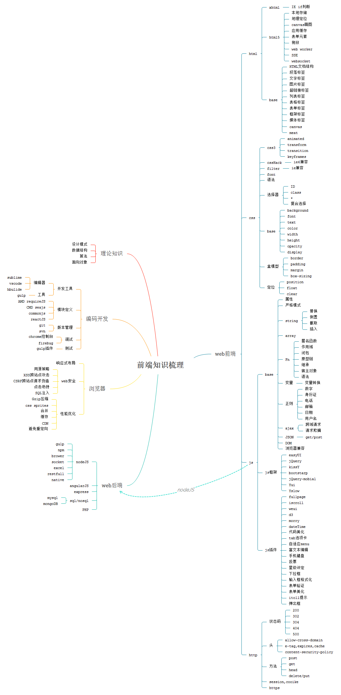

应某个小朋友的要求，其实自己本来也想整理一下，把自己这些年对前端的理解以及需要哪些知识做了一下汇总。

## 什么是前端工程师

写文章的时候查了一下前端工程师的英文--F2E,看着还不错 有个性， 其实前端工程师本来就是一个很个性的职业，一直走在前列，一直在追赶时代的潮流。网上也有很多大牛对于前端已经解释的很清楚，我在这里就不再赘述，具体的可以去看这些人的博客：

随着前端技术的日新月异，前端工程师也越来越被得到关注，从刚开始的只会切图做网页的到现在的各种js框架，各种服务器搭建，各种集成化前端测试的技术实现，前端正在逐渐迈入一个崭新的领域。 总之，前端很强大，很个性，很有成就。

## 前端需要哪些知识

前端发展到现在已经不是仅限于浏览器与静态页面了，所需要的只是也越来越多，我将我所了解的前端知识画了一张思维导图：

暂时先分为：WEB前端、WEB后端、浏览器、编码开发、理论知识五个板块，后续可能还会有删改或者补充。

### 1.WEB前端部分
主要分为 CSS，js和Html三个类别，每个类别都涉及了一部分HTML5和CSS3的内容。主要介绍了基础知识，其中HTMl5的知识会单独汇总。

### 2.WEB后端部分

主要以NodeJS为主，目前也在自学nodejs，这部分内容边学边增加吧。

### 3.浏览器部分

这部分内容主要以web安全和性能为主，后续会添加SEO优化等知识。

### 4.编码开发 

介绍开发工具及版本管理工具和测试调试工具的应用

### 5.理论知识部分

这部分属于核心思想，就像学编程语言到一定的阶段就开始深挖语言的设计思想一样，这部分的内容对深度理解js及http有很关键的作用。但是在前端刚开始学习的时候可能会对其中的内容不理解，这很正常，就像学语言一样，先学单词短语，然后再学习语法，这部分内容就是语法了。值得后续去学习。

---

一天一篇文章计划 第4天